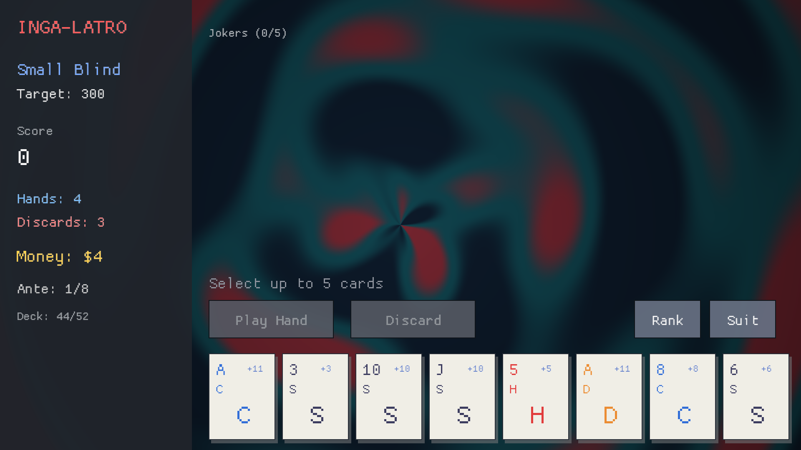

# Inga

**Typed errors. Inferred dependencies. Direct style.**
Inga is what Effect.ts would look like as its own language, with Koka's
direct style: you write ordinary code, and the compiler infers — and
enforces — what can fail (`!` row) and what it needs (`uses` row). Data is
structs and enums; `fail` raises *any* value, and the `!` row names the
types of the values a function can fail with.

```inga
use std/json
use std/schedule

struct UserNotFound = { Int id }
struct DbError      = { String cause }
struct CacheMiss    = { String key }

// Fully annotated — but every annotation here is optional and inferred:
getUserById :: (Int id) -> User ! UserNotFound uses Database, Cache, Logger {
    match cached(id) {
        Some(user) -> user
        None       -> fetchAndCache(id)
    }
}

fetchAndCache :: (id) {
    Database db          // ← binds the capability, infers `uses Database`
    Cache cache
    Logger logger

    user = db.findUser(id)
        |> retry(schedule.exponential(100.millis) |> schedule.upTo(3))
        |> orFail(UserNotFound(id))
        |> catch {
            DbError(cause) -> {
                logger.warn("db down after retries: ${cause}")
                fail UserNotFound(id)
            }
        }

    cache.set("user:${id}", json.encode(user), 5.minutes) |> ignoreFailure
    logger.info("cache refreshed for ${id}")
    user
}
```

Hover `fetchAndCache` in an editor and the language server shows what the
compiler inferred:

```
fetchAndCache :: (Int id) -> User ! UserNotFound uses Cache, Database, Logger
```

`main` must have empty rows — every error caught, every service provided —
so a program that compiles cannot hit an unhandled typed error or a missing
dependency:

```inga
main :: () {
    provide consoleLogger, memoryCache, fakeDb {
        user = getUserById(42) |> catch { UserNotFound -> User(0, "anonymous", "n/a") }
        println("fetched: ${user.name}")
    }
}
```

## Try it

```sh
cargo run -p inga-cli -- run examples/user_service.inga
```

```
[info] cache refreshed for 42
fetched: Wing <wing@anara.com>
cached:  Wing
fallback for user 7: anonymous
```

The flaky fake database refuses the first two connections — `retry` recovers
— and the second lookup hits the cache. Delete the `catch` in `main` and the
compiler answers:

```
error: `main` does not handle the error `UserNotFound`; add a `catch` for it
```

## The toolchain

One binary, everything included:

| Command | What it does |
|---|---|
| `inga run file.inga` | type-check, compile, and run (a temp native binary) |
| `inga build file.inga [-o out]` | **compile to a native binary** (LLVM IR → clang -O2) |
| `inga check files...` | diagnostics with source carets |
| `inga test [files...]` | run `test*` functions; `assert`/`assertEq` failures point at the line |
| `inga fmt [--check] files...` | canonical formatter (idempotent, keeps comments) |
| `inga highlight file.inga` | ANSI syntax highlighting in the terminal |
| `inga lsp` | language server: hover with inferred `!`/`uses` rows, diagnostics, go-to-definition, completion with **auto-import** (sibling modules + `std/*`) and **`.`-member completion** (module members, struct fields, service methods, map ops, tuple slots, duration suffixes), **arm completion** in `catch`/`match` (the row's error types, the scrutinee's variants), quick fixes on unknown names (cmd+.), formatting, semantic tokens |

Editor support lives in [`editors/vscode`](editors/vscode) (TextMate grammar
+ LSP client).

## Concurrency without a manual

Concurrency is a standard module, `std/fiber`, and the effect system does
the bookkeeping. One `provide Runtime(4)` in `main`, then:

```inga
use std/fiber

a = crunch("medium", 100000) |> fiber.fork    // crunch :: ... -> Report ! TooBig
b = crunch("large", 10000000) |> fiber.fork   // both in flight; zero locks
pair = fiber.join((a, b)) |> catch { TooBig -> (fallback, fallback) }

totals = fiber.parMap(urls, (u) -> fetch(u) |> fiber.settle)   // [Outcome<...>]
```

Errors travel in the fiber's type (`Fiber<Report ! TooBig>`, visible on
hover) and **re-raise at the join** — catch them where the result lands, or
the compiler reminds you the same way it guards `main`. `join` is
structural (a fiber, a tuple of fibers, or a list), `settle` turns the
error channel into data (`Outcome` — match `Ok`/`Failed` per element), and
`race`/`within` give deadlines. Services cross into fibers only when
declared `shared service` (scalar-only state, checked at every impl);
captured values are frozen so refcounts never race; an unjoined fiber is
interrupted when its handle drops — no leaks, no daemons. Parallelism shows
up in the row (`uses Fibers`), so a library that forks says so in its
types. Try it: `inga run examples/fibers.inga` — and
[`examples/fiber_errors.inga`](examples/fiber_errors.inga) walks every
error placement, one section each.

## Tests are built in

```sh
inga test games/logic_test.inga
```

Every zero-parameter `test*` function is a test; `assert(cond)` and
`assertEq(actual, expected)` are ordinary typed errors (`! AssertionError`),
so a failing assertion prints with the usual caret pointing at the line.
INGA-LATRO's poker evaluator is tested this way.

## The network is in your types

`std/http` is the HTTP client — and `uses Http` in a signature is how you
know a function touches the network, the same honesty as every other
capability. A non-2xx status is data (like fetch); only transport failures
raise `! HttpError`; streaming is a pull loop; deadlines and backoff are
the combinators you already have:

```inga
use std/http

fetchPrice :: (String sym) -> Float ! HttpError, TimeoutError uses Http, Fibers {
    resp = http.get("https://api.example/price/${sym}")
        |> fiber.within(2.seconds)
        |> retry(schedule.exponential(100.millis) |> schedule.upTo(3))
    resp.body |> parseInt |> getOrElse(0) |> toFloat
}
```

Try it: `inga run examples/http_client.inga` — or
[`examples/pokedex.inga`](examples/pokedex.inga): a paginated pokédex of
all 151 gen-1 pokémon with real sprites — pages fetch on background fibers
(`fiber.poll` per frame, the render fiber never parks), sprite PNGs become
textures via `graphics.imageNew`, and prev/next page through the API.

And `std/http` serves too — `http.serve(port, handler)` where the handler
is an ordinary `(HttpRequest) -> HttpResponse` function: it captures
services like any closure (`uses Counter` shows up in its row), and a
handler failure answers that client 500 *and re-raises at the serve
site* — so a silently crash-looping server is unrepresentable; catch in
the handler to keep serving. Try it, then curl localhost:8080/visit:
`inga run examples/server.inga`.

The disk works the same way: `std/fs` is the file system, `uses Fs` in a
signature is how you know a function touches it, and failures raise
`IoError { path, message }` — the path rides in the error.
`fs.read/write/append/exists/list/remove/createDir`, all blocking on the
calling fiber, all binary-safe (a file body and an http body are the same
kind of string). Try it: `inga run examples/notes.inga`.

## Graphics, and a game

Inga has GL-backed graphics bindings — the `std/graphics` module (window, rects,
circles, text, mouse, **GLSL fragment shaders**), implemented on OpenGL via
miniquad/macroquad in the native runtime and available in both backends. The
frame loop is owned by the runtime (`graphics.run(w, h, title, frame)` calls your
closure once per frame), so games don't need unbounded recursion — and the
frame closure captures capability evidence like any other Inga closure.

The proof is [`games/balatro.inga`](games/balatro.inga): **INGA-LATRO**, a
Balatro-style roguelike deckbuilder in ~1,000 lines of pure Inga, split
across six modules (`use game`, `util`, `cards`, `jokers`, `poker`, `state`) —
poker-hand scoring, escalating blinds and antes, fifteen jokers and a
rerollable shop, animated card deals/hovers/score popups, and the signature
swirling paint background written as a GLSL shader *inside the Inga source*
and compiled at runtime via `graphics.shaderNew` — plus blind-intro
banners, sellable jokers (hover one), win-screen confetti, and a freely
resizable window (every Inga game letterboxes for free). All game state lives in
one `Game` service ([`games/game.inga`](games/game.inga)) provided once in
`main` — every function just says `uses Game` (inferred), so nothing
threads state through arguments, and the
[`inga test` tests](games/logic_test.inga) provide their own fresh instance
per test. The frame closure opens with `provide Arena(256.kb)`, so
everything built while drawing is freed wholesale at frame end — the render
path does no refcount work:

```sh
inga build games/balatro.inga -o ingalatro && ./ingalatro
```



## Repository layout

```
crates/inga-core      lexer, parser, type & effect inference, formatter
crates/inga-codegen   LLVM backend (emits .ll; clang compiles and links)
crates/inga-rt        native runtime staticlib (allocator, strings, maps, clock)
crates/inga-cli       the `inga` binary
crates/inga-lsp       language server (lsp-server / lsp-types)
editors/vscode        VS Code extension + TextMate grammar
editors/zed           Zed extension (tree-sitter highlighting + LSP)
tree-sitter-inga      tree-sitter grammar (used by the Zed extension)
examples/             hello.inga, retry.inga, shapes.inga, arena.inga, fibers.inga, fiber_errors.inga, http_client.inga, pokedex.inga, notes.inga, server.inga, modules.inga (+ geometry.inga), user_service.inga
games/                balatro.inga (+ game, util, cards, jokers, poker, state, logic_test) — a Balatro-style deckbuilder
bench/                the same workloads in Inga, JavaScript, and Rust (see bench/README.md)
docs/SPEC.md          language design: semantics, effect rows, execution strategy
```

`bench/run.sh` runs five identical workloads as Inga, node, and `rustc -O`
— Inga wins every one against V8 ([results](bench/README.md)).

## How it runs

Inga is compiled, always: `inga build` produces a binary through LLVM, and
`inga run` is the same pipeline to a temp binary, executed immediately —
one backend, one semantics. Because Inga's effects are static, **the effect
system compiles away**: error rows become Rust-style `{value, err}` two-register returns,
capability rows become Koka-style evidence parameters, and a capability
method call is the same machine code as a Rust `dyn` call. Memory is
**Perceus-style ARC** (non-atomic refcounts + compiler-emitted drop glue,
small objects recycled through free lists, one heap per fiber so forking
never locks) with opt-in region arenas: `provide Arena(256.kb)` makes a
scope allocate from a region freed wholesale at scope end, deep-copying the
scope's result out as it dies. Details in
[docs/SPEC.md §6](docs/SPEC.md#6-execution-how-inga-runs).

The result ([benchmarks](bench/README.md)): **compiled Inga beats Node/V8 on
all five benchmark workloads** — 2–3× on raw calls, DI dispatch, and string
interpolation, ~290× on typed-error control flow — and beats idiomatic Rust
on two of them.

## Status

v0.3 — a complete, tested vertical slice: language (structs/enums/tuples,
record update, generics, exhaustive `match`, typed errors over any value),
inference, a **native-only LLVM backend** (`show`/`==`/`json.encode`/`json.decode`/
functions-as-values all compile; the reference interpreter served its
purpose and was removed), Perceus-style ARC + arenas with copy-out,
**`std/fiber` concurrency** (fork / structural join / settle / race /
within, `shared` services, drop-is-supervision), a built-in test runner,
formatter, LSP, editor tooling (`cargo test` covers all of it). Not yet: a
package manager, the M:N fiber scheduler (fibers run thread-per-fiber
today — same semantics, that's the point of the `Runtime` promise),
per-implementation capability precision, resumable handlers.
